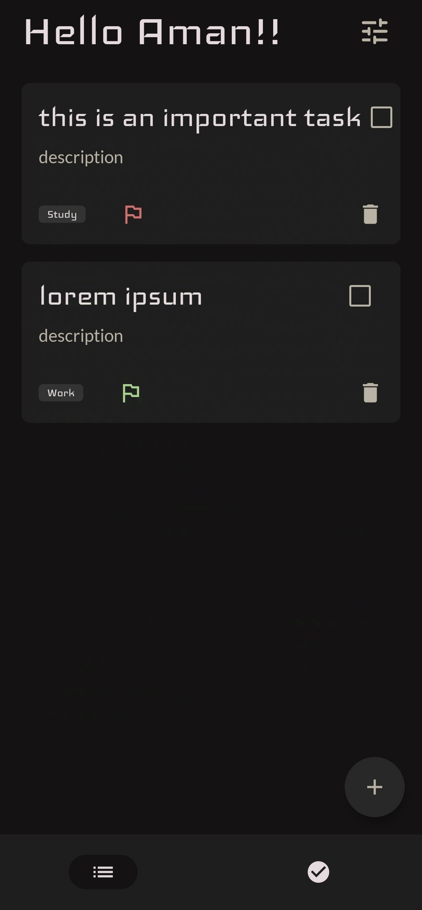
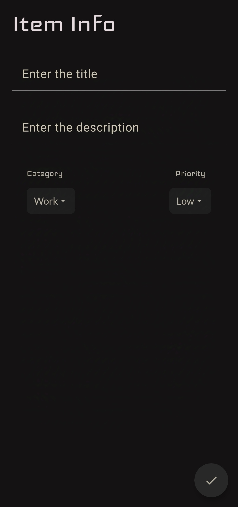

# TodoMe - A Simple Todo Management App

## Overview
TodoMe is a minimalistic, user-friendly todo management app built using Jetpack Compose. With TodoMe, you can effortlessly organize your tasks by adding, editing, and deleting todos. The app also allows you to categorize tasks and set their priority levels, making task management more efficient.

## Features
- **Add Tasks**: Create new tasks with a title, description, category, and priority.
- **Edit Tasks**: Modify existing tasks easily.
- **Delete Tasks**: Remove tasks that are no longer needed.
- **Categorization**: Assign tasks to categories such as Work, Personal, Shopping, Study, and Others.
- **Priority Management**: Set task priority to Low, Medium, or High.
- **Modern UI**: A clean and intuitive user interface designed with Jetpack Compose.
- **Settings**: Options to reset all tasks and change the user name.

## Screenshots
| Add/Edit Task Screen | Settings Screen |
|----------------------|-----------------|
|  | |

## Tech Stack
- **Programming Language**: Kotlin
- **Framework**: Jetpack Compose
- **State Management**: ViewModel
- **Database**: Room
- **Navigation**: Jetpack Navigation Component

## Installation

### Prerequisites
- Android Studio installed on your system.
- Android device or emulator with Android 6.0 (API 23) or above.

### Steps
1. Clone this repository:
   ```bash
   git clone https://github.com/yourusername/todome.git
   ```
2. Open the project in Android Studio.
3. Sync the project with Gradle.
4. Build and run the app on your connected device or emulator.

## App Structure
The app is structured into the following key packages:

- **`screens`**: Contains the screens for different app functionalities such as Add/Edit Todo, Settings, etc.
- **`room`**: Handles the database setup, including entity definitions and DAO interfaces.
- **`viewModel`**: Contains ViewModel classes for managing UI state and database operations.
- **`ui.theme`**: Defines the app's color palette and typography.

## License
This project is licensed under the MIT License. See the [LICENSE](LICENSE) file for details.

## Contributions
Contributions are welcome! Feel free to fork the repository and submit a pull request.

## Contact
For any queries or suggestions, please contact:
- **Email**: amansaini04a@gmail.com

## Releases
You can download the latest version of the app from the [Release v1.0](https://github.com/A-man404/ToDoMe/releases/tag/v1.0).

## Support Me

If you like this project, consider supporting me with a coffee! ☕️  
[](https://buymeacoffee.com/aman010)


